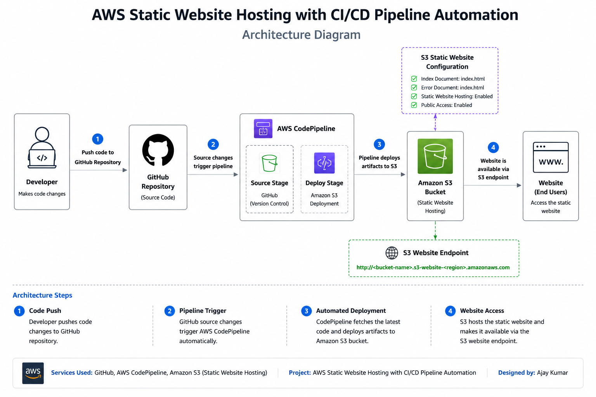

# AWS Static Website Hosting with CI/CD Pipeline Automation

## Project Overview

Designed and implemented an automated CI/CD pipeline on AWS for static website hosting using GitHub, CodePipeline, CodeBuild, Amazon S3, and CloudFront. The solution enables continuous deployment, reduces manual effort, and delivers website content globally through AWS cloud services.

---

## Architecture Diagram



---

## AWS Services Used

* Amazon S3 — Static website hosting
* GitHub — Source code repository
* AWS CodeBuild — Automated build service
* AWS CodePipeline — CI/CD pipeline orchestration
* AWS IAM — Roles and permissions
* Amazon CloudFront — Global content delivery (CDN)

---

## How It Works

```text
Developer pushes code to GitHub
            ↓
CodePipeline detects the change
            ↓
CodeBuild builds and validates files
            ↓
CodePipeline deploys to S3 automatically
            ↓
Website updated globally through CloudFront
```

---

## Project Architecture Workflow

1. Developer updates website code locally
2. Code pushed to GitHub repository
3. CodePipeline automatically detects the change
4. CodeBuild executes the build process
5. Website files deployed to S3 bucket
6. CloudFront distributes content globally
7. Users access the website through CloudFront

---

## Key Features

* Fully Automated CI/CD Pipeline
* Zero Manual Deployment
* Global Content Delivery via CloudFront
* S3 Static Website Hosting
* IAM Role Based Security

---

## Project Structure

```text
aws-static-website-cicd-pipeline/
├── Architecture-Diagram/
├── Screenshots/
├── assets/
├── images/
├── index.html
└── README.md
```

---

## Implementation Summary

### S3 Setup

* Created S3 bucket for static website hosting
* Enabled public access for website
* Configured S3 bucket policy for public website access

### CloudFront Setup

* Created CloudFront distribution
* Selected S3 bucket as the origin
* Configured Default Root Object as index.html
* Enabled global content delivery through CloudFront edge locations
* Verified successful website access using CloudFront domain URL

### CI/CD Pipeline Setup

* Connected GitHub repository as source
* Configured AWS CodeBuild project
* Created CodePipeline with 3 stages:

  * Source — GitHub
  * Build — CodeBuild
  * Deploy — S3

### IAM Configuration

* Created IAM roles for CodeBuild and CodePipeline
* Configured least privilege permissions
* Attached necessary policies

---

## CloudFront Content Delivery Network (CDN)

Amazon CloudFront was integrated with the S3 static website to provide low-latency content delivery, improved performance, enhanced availability, and faster access for users across global edge locations.

### Implementation Steps

* Created a CloudFront Distribution
* Selected the S3 bucket as the origin
* Disabled AWS WAF for this project
* Configured Default Root Object as index.html
* Enabled global content delivery through CloudFront edge locations
* Verified successful website access using the CloudFront domain URL

### Outcome

The website is now delivered through CloudFront, providing faster content delivery, lower latency, and improved user experience worldwide.

---

## Testing and Validation

* ✅ Pipeline triggered automatically on code push
* ✅ CodeBuild completed successfully
* ✅ Website deployed to S3
* ✅ CloudFront serving content globally
* ✅ Website accessible via CloudFront URL
* ✅ Pipeline validated with 2 successful runs

---

## Learning Outcomes

* AWS CI/CD Pipeline implementation
* S3 Static Website Hosting
* CloudFront CDN configuration
* GitHub, CodeBuild, CodePipeline integration
* IAM Role and Policy management
* Automated deployment workflows
* DevOps best practices on AWS

---

## Conclusion

This project demonstrates a real-world CI/CD pipeline implementation on AWS that eliminates manual deployment effort. The automated pipeline ensures faster, reliable, and consistent website deployments using native AWS DevOps services.
